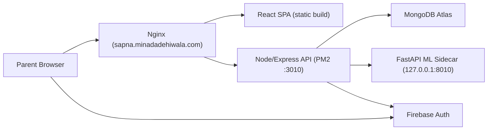

# SAPNA Parent-Centric Toddler Monitoring

Parent-mediated toddler development monitoring platform aligned to the NSBM research proposal.

## Live Links

- Production App: [https://sapna.minadadehiwala.com](https://sapna.minadadehiwala.com)
- API Health: [https://sapna.minadadehiwala.com/api/health](https://sapna.minadadehiwala.com/api/health)

## Highlights

- Parent-first UX to reduce direct toddler screen exposure
- Firebase Auth integration (email/password flow)
- Secure parental consent gate before milestone logging
- Explicit screening/data-use acknowledgments during consent
- 12-36 month activity library with seeded offline interventions
- Structured interaction logs and progress dashboard
- Weekly screening summaries with ML prediction + rules fallback
- Parent privacy controls: JSON export + account/data deletion
- Proposal-aligned synthetic data generation, RF/SVM benchmarking, and compact deployed inference bundle
- Shared-EC2, isolated-domain deployment without impacting existing services

## Architecture



## Tech Stack

- Frontend: React + Vite + Firebase Web SDK
- Backend: Node.js + Express + Mongoose
- ML Service: Python 3.9 + FastAPI + scikit-learn
- Auth: Firebase ID tokens + backend verification
- Database: MongoDB Atlas
- Deployment: AWS EC2 + PM2 + Nginx + Let's Encrypt

## Feature Scope (MVP)

- Parent account onboarding and profile bootstrap
- Consent capture with versioning and timestamp
- Child profiles with minimal PII (nickname, DOB, optional sex)
- Soft warning outside the 12-36 month target band
- Guided physical/offline activity catalog
- Activity logging:
  - duration
  - success level
  - parent confidence
  - notes
- Dashboard analytics over recent logs
- Weekly report generation:
  - status classification (`on_track`, `needs_monitoring`, `at_risk`)
  - prediction source badge (`ML` or `Rules Fallback`)
  - prediction confidence + class probabilities
  - top risk/positive factors
  - domain breakdown
  - recommendations
  - non-diagnostic medical disclaimer
- Privacy APIs:
  - `GET /api/privacy/export`
  - `DELETE /api/privacy/account` with `confirmationText: "DELETE MY DATA"`

## Quick Start (Local)

### 1. Backend

```bash
cd backend
cp .env.example .env
npm install
npm run check
npm run seed:activities
npm run dev
```

Run automated API tests:

```bash
npm test
```

Backend default: `http://localhost:3010`

### 2. Frontend

```bash
cd frontend
cp .env.example .env
npm install
npm run dev
```

Run automated UI smoke tests:

```bash
npm test
```

Frontend default: `http://localhost:5173`  
Vite proxies `/api` to `http://localhost:3010`.

### 3. ML Service

Create synthetic data, train all proposal-aligned models, run the ML test suite, and refresh the production artifact bundle:

```bash
cd ml-service
./scripts/run_local_ml_pipeline.sh
```

Run the inference API locally:

```bash
cd ml-service
source .venv/bin/activate
uvicorn app.main:app --host 127.0.0.1 --port 8010
```

Run the ML-only automated tests:

```bash
cd ml-service
source .venv/bin/activate
pytest tests
```

The local production artifact bundle is written to:

- `ml-service/artifacts/production/model.joblib`
- `ml-service/artifacts/production/feature_schema.json`
- `ml-service/artifacts/production/label_mapping.json`
- `ml-service/artifacts/production/metrics.json`
- `ml-service/artifacts/production/model_version.txt`

Training reports are written to:

- `ml-service/reports/training_metrics.json`
- `ml-service/reports/training_report.md`

Latest validated local training result:

- Generated dataset: `19,997` child-week samples
- Generated raw logs: `153,606`
- Evaluated models: `random_forest`, `svm`, `hybrid_rf (PCA + RandomForest)`
- Selected production model: `random_forest`
- Holdout macro-F1: `0.9634`

## Firebase Setup

Project used:

- `sapna-toddler-monitoring-2026`

Backend env (`backend/.env`):

- `FIREBASE_PROJECT_ID`
- Optional advanced mode:
  - `FIREBASE_CLIENT_EMAIL`
  - `FIREBASE_PRIVATE_KEY` (escaped newlines)

Frontend env (`frontend/.env`):

- `VITE_FIREBASE_API_KEY`
- `VITE_FIREBASE_AUTH_DOMAIN`
- `VITE_FIREBASE_PROJECT_ID`
- `VITE_FIREBASE_STORAGE_BUCKET`
- `VITE_FIREBASE_MESSAGING_SENDER_ID`
- `VITE_FIREBASE_APP_ID`

## MongoDB Atlas Setup

Use connection format:

```bash
mongodb+srv://app_user:<PASSWORD>@toddler-monitoring-clus.nccnda5.mongodb.net/toddler_monitoring?retryWrites=true&w=majority&appName=toddler-monitoring-cluster
```

Allowlist:

- EC2: `18.139.192.254/32`
- Local development IP (`/32`)

## Deployment (Shared EC2, Domain-Isolated)

```bash
./deploy/deploy-to-ec2.sh
```

Script actions:

- sync repo to `/home/ec2-user/sapna-toddler-monitoring`
- install backend/frontend dependencies
- install/update ML sidecar virtualenv + requirements
- restart PM2 apps `sapna-toddler-api` and `sapna-ml-api`
- build and publish static frontend to `/var/www/sapna.minadadehiwala.com`
- apply isolated nginx vhost + reload

The ML service stays internal-only on EC2 and is not exposed through nginx.  
Node calls it over `http://127.0.0.1:8010`.

SSL setup:

```bash
bash deploy/enable-ssl.sh
```

## Safety & Ethics

- This system is a screening/monitoring aid, not a clinical diagnosis.
- Parents are directed to professional healthcare assessment for formal diagnosis.
- Consent-first data collection and controlled parent ownership of logs.
- Production ML always keeps a transparent rules fallback when the sidecar is unavailable or not confident enough.
